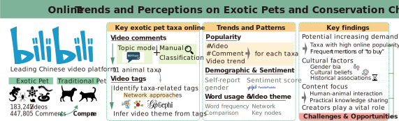
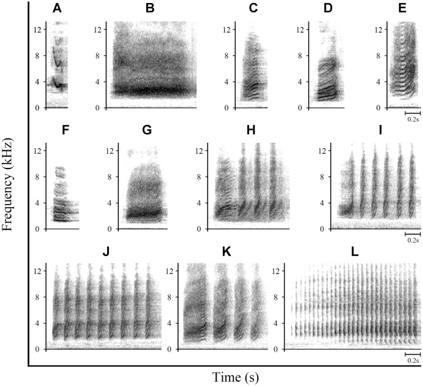



Research
===
Conservation culturomics
---
My main area of interest is in conservation culturomics, especially **how digital data can inform conservation priorities and strategies**. In today’s digital age, social media plays an important role in shaping how people perceive and interact with the natural world. Conservation culturomics is a rapidly growing field within conservation science, which leverages digital data to uncover trends in human-nature interactions. This innovative approach not only provides new opportunities to explore public attitudes and behaviors towards nature but also helps develop effective conservation strategies. 

As part of my MSc thesis, I collected over 6 million comments and 60,000 unique tags from over 1 million animal-related videos on Bilibili, a major Chinese video-sharing platform. This research focused on **exploring internet cat content by examining patterns in user engagement and their implications for cat management**. Using culturomic analysis with NLP techniques and network analysis, we compared key patterns in cat videos to other animal-related content from the perspectives of both viewers and creators. This research revealed that cat videos consistently generate higher emotional engagement than other animal content, with viewers frequently expressing affection and attributing personhood to cats. While cuteness is a major factor, it is not exclusive to cats. Content creators specializing in cat media also play a critical role in shaping public perceptions and attitudes. These findings suggest that conservation efforts could benefit from leveraging social media and collaborating with influencers to promote responsible pet ownership and ecological awareness. Balancing emotional connections to cats with the ecological challenges they pose is essential for developing sustainable management strategies.

  
_Haozhong Si, Fan Yu, Lee Tien Ming, Zhongqiu Li*. Millions of pet videos deepen our understanding of human-cat interactions with implications for management. People and Nature (Under review)_

Social media platforms have created a dynamic space for sharing exotic pet content, which can both fuel demand and spread misconceptions about pet care and conservation. I also investigated the exotic pet videos to **identify the main taxa featured on social media, and the trends and patterns shaping the online community**. This research revealed significant interest from creators and viewers in taxa such as Testudines, Arachnida, Lacertilia, Serpentes, and Insecta, with rising demand indicated by frequent mentions of “to buy”. Viewer engagement with these animals appears influenced by demographic factors, cultural beliefs, and historical associations. Furthermore, the online community emphasizes human-animal interaction and practical knowledge sharing, with content creators playing a crucial role within the community. These insights highlight both the challenges and opportunities that social media presents for exotic pet management. We suggest that targeted educational campaigns and informed policies could better address the ethical and ecological challenges of exotic pet ownership. Through collaboration among creators, viewers, and policymakers, social media could be used to encourage responsible practices and support biodiversity conservation.

_Haozhong Si, Anna Hausmann, and Zhongqiu Li*. From Screen to Species: Online Trends and Perceptions on Exotic Pets and Conservation Challenges._

I am also very interested in the biases in species knowledge across taxa and regions. Public engagement is essential to slow biodiversity loss, yet many endemic and threatened species receive insufficient attention. Using birds as a model group, regarding their ecological importance and cultural visibility, I **explored the factors driving scientific and public interest in different species**. I compiled a comprehensive dataset of birds' phenotypic, ecological, and cultural traits, using the number of published papers and Wikipedia pageviews as indicators of scientific and public interest. This study revealed that factors related to public familiarity and species charisma significantly shape public and scientific priorities. In contrast, threatened or range-restricted species often receive little public attention, with IUCN status alone proving insufficient to sustain public interest. To address this imbalance, targeted strategies such as media campaigns and conservation education should better engage the public and scientific communities. These efforts are crucial to ensure conservation initiatives encompass a broader range of species, particularly those at greatest risk of being overlooked.

Haozhong Si, Changjian Fu, Fan Yu, and Zhongqiu Li*. Feathered Icons: Drivers of Global Attention on Bird Species.
* * *
Animal behavior
---
I am also fascinated by the field of animal behavior, with interests spanning acoustic communication, movement ecology, and social structures. For example, with colleagues at the lab of Animal Behavior and Conservation (ABC) at Nanjing University, we **investigated the vocal repertoire of Azure-winged Magpie (_Cyanopica cyanus_)**, a cooperatively breeding bird species. Our results showed that Azure-winged Magpies had a relatively large vocal repertoire, consisting of twelve distinct calls. These calls were associated with the context including movement, begging for food, contact, vigilance against predators, etc. This study laid the foundation for further investigation on the developmental mechanisms of bird vocalizations.

Xu Wang, Fan Yu, Haozhong Si, Zhongqiu Li*. Vocal repertoire of Azure-winged Magpies (_Cyanopica cyanus_): A context-associated communication system[J]. Avian Research, 2023, 14, 100089. 
